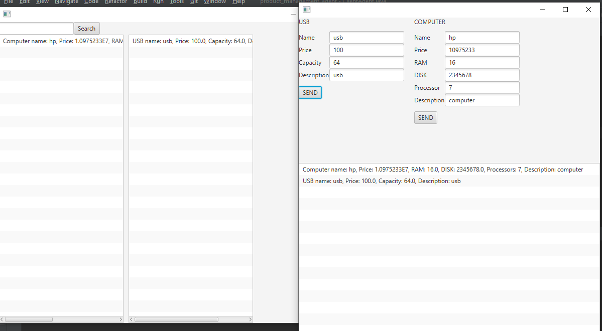

Ce projet implique une architecture client-serveur, où le serveur est responsable de la publication des produits et de l'envoi des messages correspondants aux clients. Les produits publiés dans ce projet sont un ordinateur et une clé USB. Le serveur envoie des messages (Ontologies) contenant des détails sur les produits aux clients, qui sont ensuite affichés dans l'interface utilisateur, 

les données des produits publiées par le serveur sont affichées dans une ListView dans l'interface utilisateur du client. La ListView est une fonctionnalité commune dans les interfaces utilisateur pour l'affichage de données sous forme de liste. Les détails des produits, tels que leur nom, leur description, leur prix et leur disponibilité, peuvent être affichés dans la ListView pour permettre aux utilisateurs de visualiser facilement les produits disponibles.

